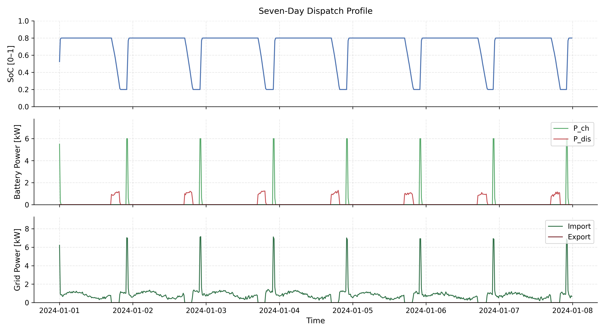
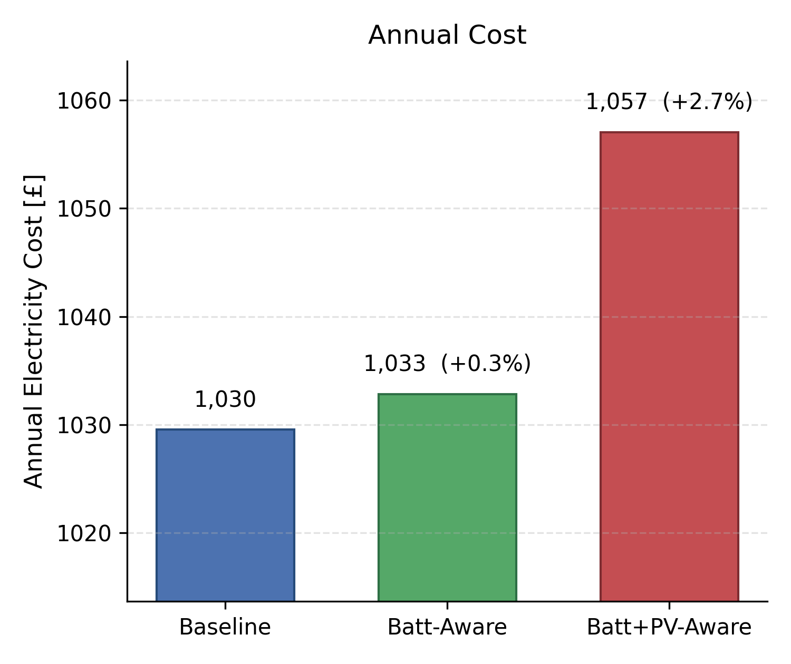
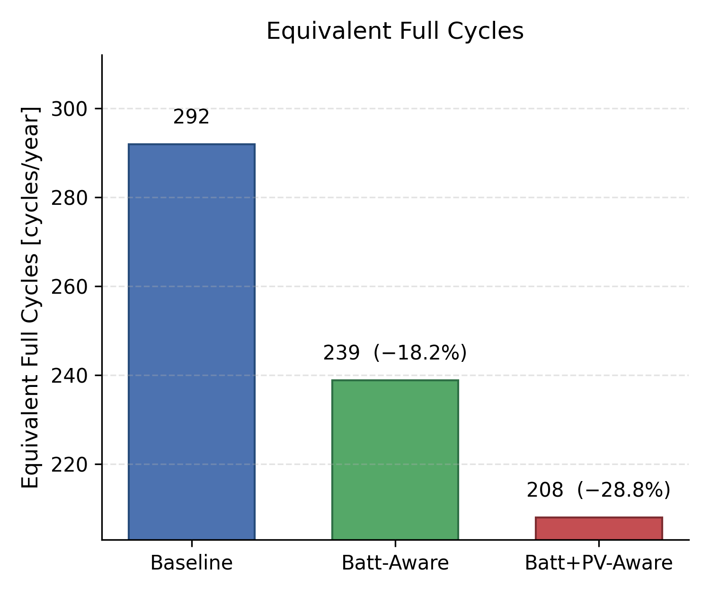
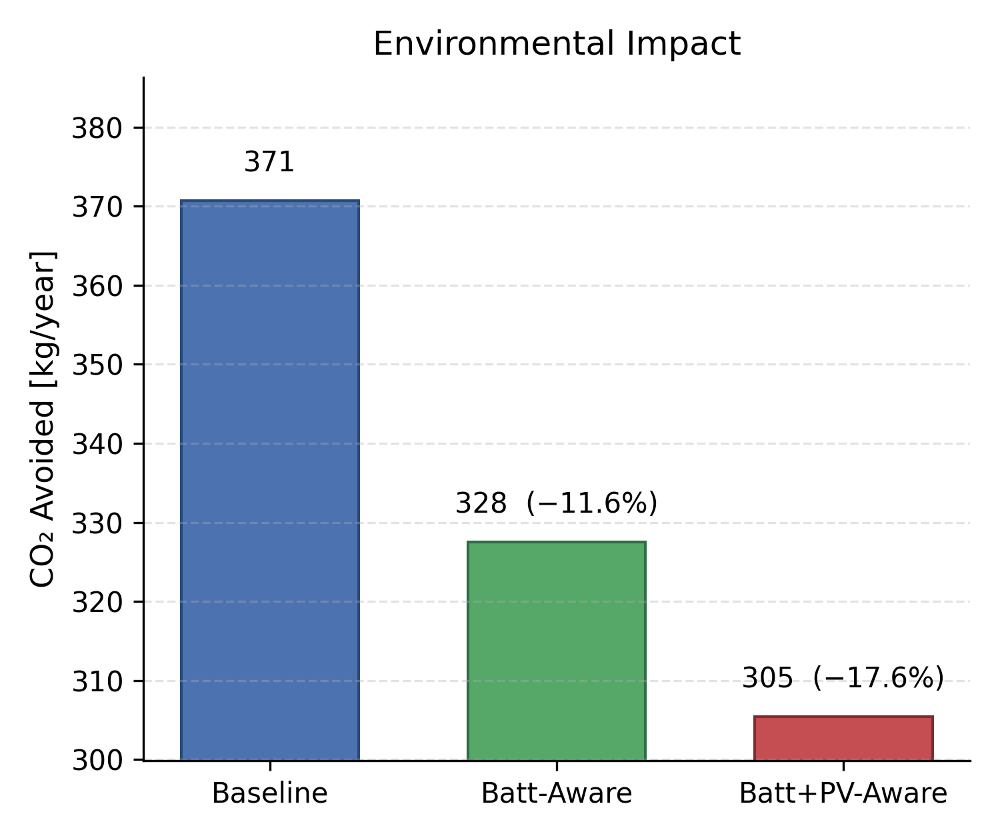
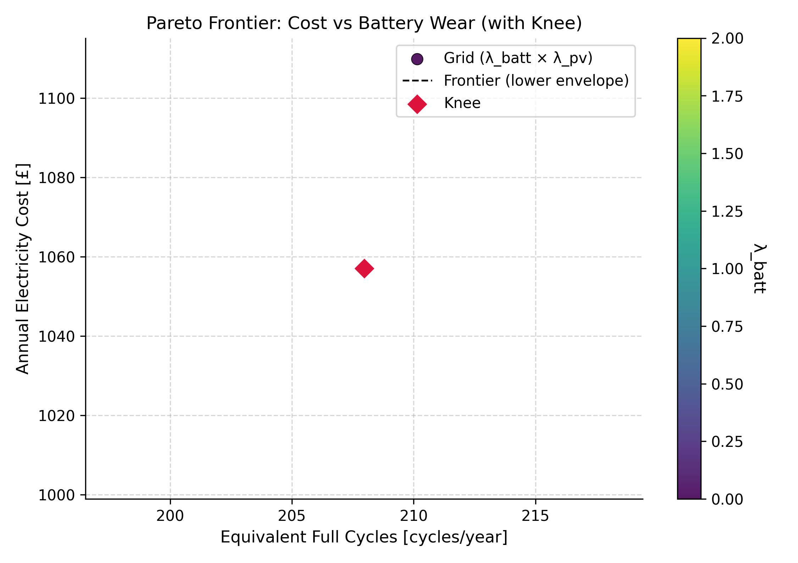

<div align="center">

# Materials-Aware Digital Twin for Solar–Battery Systems

### Lifecycle-aware digital twin modelling, dispatch optimisation, degradation analysis and interactive visualisation for PV–battery energy systems

[](https://github.com/ogatech4real/Material_Aware_Digital_Twin)
[](https://pvbattdt.streamlit.app/)
[](https://www.python.org/)
[](LICENSE)

</div>

---

## Overview

This repository contains the complete implementation of the **Materials-Aware Digital Twin (MAT-DT)** framework for solar photovoltaic (PV) and battery energy storage systems.

The framework extends conventional energy-management simulation by embedding **asset degradation and lifecycle awareness** into operational assessment and control. It links time-series PV generation, household demand, battery state, degradation behaviour, dispatch decisions, economic performance and environmental indicators within a reproducible digital-twin workflow.

The complete implementation of the materials-aware digital twin framework, including source code, configuration files and simulation output, is available here:

**Repository:** https://github.com/ogatech4real/Material_Aware_Digital_Twin

An interactive Streamlit-based dashboard is available to visualise dispatch behaviour, degradation metrics and key performance indicators:

**Live dashboard:** https://pvbattdt.streamlit.app/

---

## Framework at a Glance

<p align="center">
  
</p>

<p align="center"><em>Overview of the Materials-Aware Digital Twin framework and its principal information and decision layers.</em></p>

The digital twin is organised around an iterative workflow in which operational data and model states are transformed into dispatch and lifecycle indicators. Its principal functions include:

- PV, load and tariff time-series processing;
- battery state and degradation tracking;
- PV performance and ageing representation;
- scenario-aware dispatch and optimisation;
- cost, carbon and lifecycle KPI evaluation;
- Pareto and statistical analysis;
- reproducible simulation outputs; and
- interactive exploration through the Streamlit dashboard.

---

## Interactive Digital Twin Dashboard

The companion Streamlit application provides an interactive view of the digital-twin results, allowing rapid inspection of dispatch behaviour, degradation indicators and selected system KPIs.

### Launch the dashboard

**https://pvbattdt.streamlit.app/**

<p align="center">
  <a href="https://pvbattdt.streamlit.app/">
    
  </a>
</p>

<p align="center"><em>Interactive Streamlit dashboard for examining system operation, dispatch behaviour, degradation metrics and performance indicators.</em></p>

---

## Research Motivation

Most PV–battery energy-management approaches optimise short-term operation using objectives such as electricity cost, self-consumption or grid interaction. However, operational decisions can also affect long-term asset health.

The MAT-DT framework introduces **materials awareness** into the digital-twin loop by explicitly representing equipment ageing alongside conventional operational objectives.

This enables the framework to examine trade-offs between:

- short-term energy-management performance;
- battery cycling and degradation;
- PV ageing and derating;
- economic performance;
- environmental benefit;
- asset-use intensity; and
- longer-term lifecycle implications.

The objective is not merely to reproduce system behaviour, but to provide a transparent environment for evaluating how different control strategies influence both immediate performance and equipment condition.

---

## Digital Twin Workflow

The implementation follows six connected functional stages:

1. **Data generation and preparation** — produces or loads time-series inputs for PV generation, electrical demand and tariff signals.
2. **Asset-state modelling** — tracks relevant system states, including battery operation and degradation-related variables.
3. **Forecast and decision inputs** — provides the near-term information required by the dispatch or optimisation layer.
4. **Dispatch and optimisation** — evaluates operational actions under alternative lifecycle-awareness assumptions.
5. **State update** — applies the selected decisions and updates the digital-twin state through time.
6. **Performance evaluation** — calculates economic, environmental and lifecycle KPIs and produces reproducible outputs.

---

## Repository Structure

```text
Material_Aware_Digital_Twin/
│
├── main.py                     # Main simulation entry point
├── config.yaml                 # Global model and experiment configuration
├── requirements.txt            # Python dependencies
│
├── data/                       # Input and generated time-series data
│
├── src/                        # Core digital-twin implementation
│   ├── data_generator.py       # Input/time-series generation
│   ├── controller.py           # Dispatch/control logic
│   ├── degradation_models.py   # Battery and PV ageing models
│   ├── optimizer.py            # Operational optimisation/dispatch
│   ├── evaluation.py           # KPI computation
│   ├── plots.py                # Plotting and visualisation
│   └── analysis_extensions.py  # Extended statistical/Pareto analysis
│
├── results/                    # Simulation outputs and KPI files
│
└── figs/                       # Framework, dashboard and result figures
```

---

## Core Capabilities

### Materials-aware operation
The framework incorporates battery and PV ageing information into the digital-twin representation so that lifecycle effects can be evaluated alongside conventional operational outcomes.

### Scenario-based comparison
Different control assumptions can be compared under a consistent system configuration, supporting analysis of the effect of degradation awareness on dispatch decisions and resulting KPIs.

### Reproducible simulation
Configuration-driven experiments allow the simulation workflow and figures to be regenerated from the repository.

### KPI evaluation

| Dimension | Example indicators |
|---|---|
| Economic | Annual electricity cost and related operating-cost measures |
| Battery lifecycle | Equivalent full cycles, throughput and degradation-related metrics |
| PV lifecycle | PV degradation / performance change |
| Environmental | Avoided CO₂ emissions |
| Operational | Dispatch profiles, energy flows and system-state trajectories |

### Trade-off analysis
The analysis layer supports investigation of competing objectives, including operational cost and degradation-related performance.

---

## Example Outputs

### Dispatch behaviour

<p align="center">
  
</p>

### Economic KPI

<p align="center">
  
</p>

### Battery utilisation

<p align="center">
  
</p>

### Environmental performance

<p align="center">
  
</p>

### Pareto analysis

<p align="center">
  
</p>

---

## Installation

### 1. Clone the repository

```bash
git clone https://github.com/ogatech4real/Material_Aware_Digital_Twin.git
cd Material_Aware_Digital_Twin
```

### 2. Create a virtual environment

**Windows**

```bash
python -m venv .venv
.venv\Scripts\activate
```

**Linux/macOS**

```bash
python3 -m venv .venv
source .venv/bin/activate
```

### 3. Install dependencies

```bash
pip install -r requirements.txt
```

---

## Run the Digital Twin

Execute the main workflow with:

```bash
python main.py
```

Generated outputs are written primarily to:

```text
results/
figs/
```

---

## Configuration

The principal experiment settings are stored in:

```text
config.yaml
```

This centralises model parameters and makes experiments easier to reproduce and modify.

Before running alternative scenarios, review the configuration carefully and retain a copy of the settings associated with any reported result.

---

## Reproducing the Analysis

A typical reproducibility workflow is:

```text
1. Clone the repository
2. Install the dependencies
3. Review config.yaml
4. Run python main.py
5. Inspect results/
6. Inspect figs/
7. Compare scenarios and KPIs
8. Explore the interactive Streamlit dashboard
```

The repository is structured so that modelling, evaluation and plotting remain separated into reusable modules.

---

## Key Generated Figures

| Output | Repository file |
|---|---|
| Full dispatch profile | `figs/dispatch_full.png` |
| Annual cost KPI | `figs/kpis_annual_cost_gbp.png` |
| Equivalent full cycles | `figs/kpis_equivalent_full_cycles.png` |
| Avoided CO₂ emissions | `figs/kpis_co2_avoided_kg.png` |
| Pareto trade-off analysis | `figs/pareto.png` |
| Framework overview | `figs/overview framework.png` |
| Streamlit dashboard | `figs/Streamlit dashboard.jpg` |

---

## Reproducibility Notes

The repository is intended to support transparent inspection of the implementation underlying the MAT-DT framework.

For reproducible use:

- retain the exact configuration used for each experiment;
- keep software dependencies consistent;
- avoid modifying generated results manually;
- regenerate figures from the simulation pipeline after changing model parameters; and
- record any externally supplied datasets or alternative assumptions separately.

---

## Research Use

The framework can support further investigation of topics such as:

- lifecycle-aware residential energy management;
- PV–battery digital twins;
- degradation-aware dispatch;
- techno-economic assessment;
- carbon-aware energy optimisation;
- battery-health-conscious control;
- robustness and sensitivity analysis;
- digital-twin visualisation; and
- future hardware-in-the-loop or real-system integration.

---

## Live Resources

| Resource | Link |
|---|---|
| Source-code repository | [Material_Aware_Digital_Twin](https://github.com/ogatech4real/Material_Aware_Digital_Twin) |
| Interactive dashboard | [pvbattdt.streamlit.app](https://pvbattdt.streamlit.app/) |

---

## Citation

If you use this repository, its code, results or framework in academic work, please cite the associated publication describing the **Materials-Aware Digital Twin for Solar–Battery Systems**.

The final bibliographic citation and DOI should be added here once formally assigned by the publisher.

---

## License

This repository is distributed under the **MIT License**, subject to the terms provided in the repository's `LICENSE` file.

---

## Contact

**Adewale Ogabi**  
School of Computing, Engineering and Digital Technologies  
Teesside University, UK

Email: `hello@adewaleogabi.info`  
Alternative: `ogabi.adewale@gmail.com`

GitHub: [@ogatech4real](https://github.com/ogatech4real)

---

<div align="center">

### Materials-aware intelligence for more transparent PV–battery lifecycle decisions

[Repository](https://github.com/ogatech4real/Material_Aware_Digital_Twin) · [Live Dashboard](https://pvbattdt.streamlit.app/)

</div>
